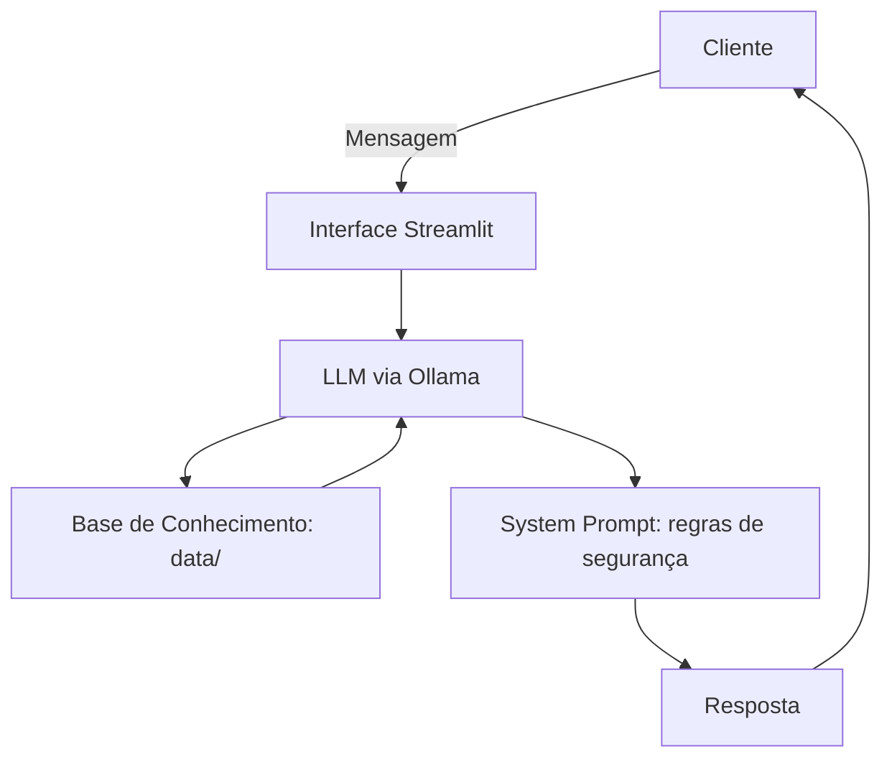

# 🤖 Hip — Educador Financeiro com IA Generativa

Projeto do desafio **Agente Financeiro Inteligente** (DIO): um agente conversacional que ensina conceitos de finanças pessoais e investimentos, usando os dados do próprio cliente como exemplo — e que, por decisão de design, **nunca recomenda onde investir**.

## O Agente

**Hip** é um tutor financeiro, não um consultor. Ele explica como funcionam renda fixa, risco, liquidez e diversificação a partir da situação real do cliente (gastos, reserva de emergência, metas), mas se recusa a indicar produtos ou investimentos específicos — inclusive sob insistência ou em cenários hipotéticos. Essa é a regra central do projeto, não um detalhe de implementação.

📄 Documentação completa: [`docs/documentacao-agente.md`](./docs/documentacao-agente.md)

## Estrutura do Repositório

```
├── README.md
├── requirements.txt
│
├── data/                          # Dados mockados do cliente
│   ├── transacoes.csv             # Transações recentes
│   ├── historico_atendimento.csv  # Atendimentos anteriores
│   ├── perfil_investidor.json     # Perfil, objetivos e metas do cliente
│   └── produtos_financeiros.json  # Produtos disponíveis para consulta educacional
│
├── docs/                          # Documentação do projeto
│   ├── documentacao-agente.md     # Caso de uso, persona, arquitetura, segurança
│   ├── base-conhecimento.md       # Como os dados viram contexto do agente
│   ├── prompts.md                 # System prompt, exemplos e edge cases
│   └── metricas.md                # Cenários de teste e resultados de avaliação
│   
│
├── src/
│   |── app.py                     # Aplicação Streamlit + Ollama
|   └── Doc.md                     # Explica o código
│
├── assets/                        # Diagramas e roteiro do lab
└── examples/                      # Referências de implementação do desafio
```

## Como Rodar

1. Instale o [Ollama](https://ollama.com) e baixe o modelo configurado em `src/app.py` (atualmente `mistral`):
   ```bash
   ollama pull mistral
   ```
2. Instale as dependências:
   ```bash
   pip install -r requirements.txt
   ```
3. Suba o app a partir da raiz do projeto:
   ```bash
   streamlit run src/app.py
   ```

O app carrega os arquivos de `data/` em memória, monta o contexto do cliente e envia cada pergunta ao modelo local via Ollama (`http://127.0.0.1:11434`), seguindo as regras do system prompt definido em `docs/prompts.md`.

## Arquitetura (resumo)



Detalhes de como cada arquivo de `data/` é usado (e o que não é usado como critério de recomendação) estão em [`docs/base-conhecimento.md`](./docs/base-conhecimento.md).

## Status Atual

- ✅ Documentação do agente, base de conhecimento e prompts definidos e versionados em `docs/`.
- ✅ Protótipo funcional em Streamlit, rodando com Ollama local (`mistral`).
- ⚠️ **Avaliação em andamento:** testes estruturados (`docs/metricas.md`) mostraram que o modelo `mistral` falha em 3 de 5 cenários — ora recomendando produtos por perfil (violando a regra central do agente), ora ignorando dados já presentes no contexto. Troca de modelo está sendo avaliada.
- ⏳ Pitch (3 min) ainda não gravado — roteiro em [`docs/05-pitch.md`](./docs/05-pitch.md).

## Ferramentas Utilizadas

| Categoria | Ferramenta |
|-----------|-------------|
| **LLM** | [Ollama](https://ollama.com) (local) |
| **Interface** | [Streamlit](https://streamlit.io/) |
| **Dados** | `pandas` + JSON mockado em `data/` |
